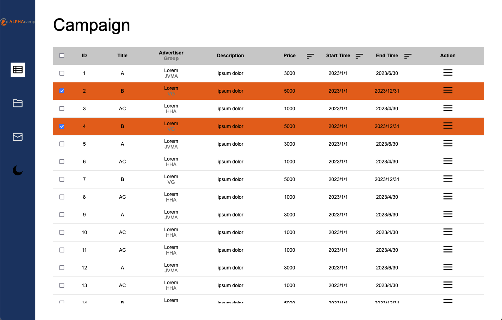
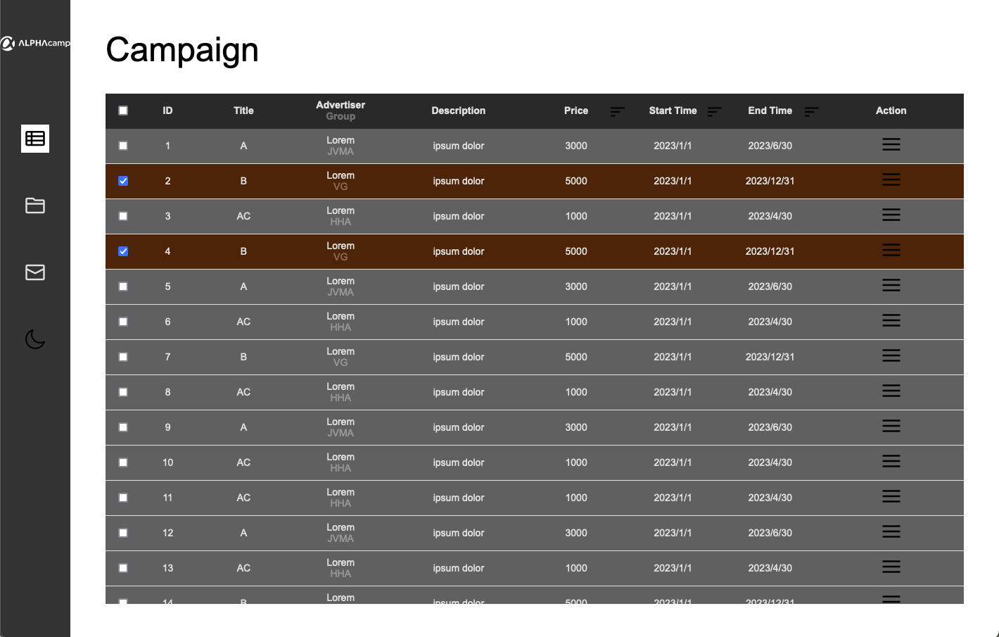
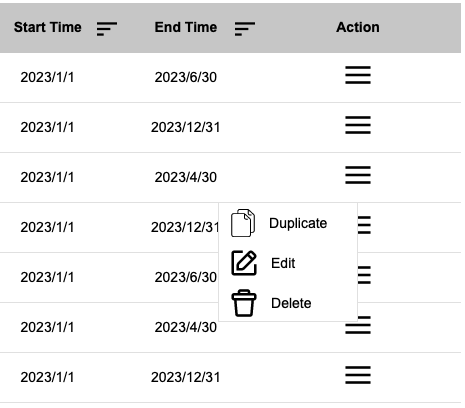

## :memo: T2-3 A24: 切版挑戰：完成廣告系統

### Github
程式碼與靜態網頁 | [REPO](https://github.com/LJBL22/ac_term_2-3/tree/main/opt_backstage-table/) | [DEMO](https://ljbl22.github.io/ac_term_2-3/opt_backstage-table/) |

### 指定功能

1. **廣告被選擇時的樣式**：利用事件 change ，會在父層加上 class ，改變背景顏色
2. **固定 table header**：
在 table 外層加一個 wrapper 來控制高度（以生成 scrollbar) ，
利用 scrollbar 的設定修掉預設的樣式，成為指定的無樣式。

### 其他細節：
1. **利用 Sass 做出 dark theme:** 大約花了4-5小時思索、整理資料、寫技術筆記，算是個意外，但也收穫好的結果。
    - 前面學到 CSS variable 很喜歡，就用在其他專案；後來又學到 SaSS ，就想嘗試用新的技術來完成專案。在 dark theme 的部分撞到困難，了解到因為 SaSS 的本質是編譯/預處理，才意識到想像中的一鍵抽換所有變數，在 Sass 是不會發生的。Sass 主要用途就是編譯，經過編譯 (compiled) 完成，輸出 css 檔案；完成即不回溯，沒有這種 toggle 抽換的方式。
    - 但又不甘心砍掉重練回去，因此就勤查關鍵字、深入研究，也找到其他同路人提供解法，也了解在某些需要的情境下/公司需求可以利用這個 workaround 維護性也不錯。
    - 總得來說，平常的專案選用 css variable 、直覺好用，需要的時候可採用這次的作法。附上我的[技術筆記](https://medium.com/@LJBL/用-sass-抽換變數-dark-theme-by-sass-not-css-variable-5c62ddad8681)整理參考。

4. 用變數儲存陣列，模擬日後**資料庫資料**；搭配 JavaScript **IIFE** 來自動呼叫、**生成表格**。時間：30min。
6. 每一行的 action icon 都可點選，透過綁定的 input/ menu id ，都可以叫出專屬的隱藏 menu 列表。時間：1小時。

### 優化方向：
1. 一鍵全選
2. 隔行顏色
3. sort 排序
4. RWD 表格
